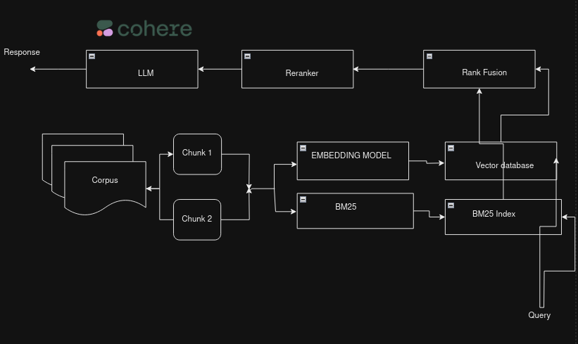

Source: https://github.com/sharad461/english-corpus-nepal

Create a `.env` file and add `cohere_api_key`

    COHERE_API_KEY=<your_key>

Do:

``
pip install -r requirements.txt
``
Run:

``
python dataset_creation.py 
``
and then
``
python main.py --question="<your_question>"
``

## Description
A semantic search engine on nepali news corpus.

## Methods
For datasets preparation, `RecurisiveTextSplitter` is used.
Then, after preparaing the chunk, it is send to `Milvus` for storage.
[SnowFlake](https://huggingface.co/Snowflake/snowflake-arctic-embed-s) is used for embeddings and re-ranking too.
> I have played with sentence-transformers/all-MiniLM-L6-v2 for re-ranking but it did not work well

Then, the traditionala BM25 re-ranker were used with embedding retrieval method for a better retrieval. `EnsembleRetrieval` from langchain worked well for rank fusion.

After getting the documents from ensemble retrieval , the documents were then fed to a LLM model for a good question answer generation.

## Architecture

